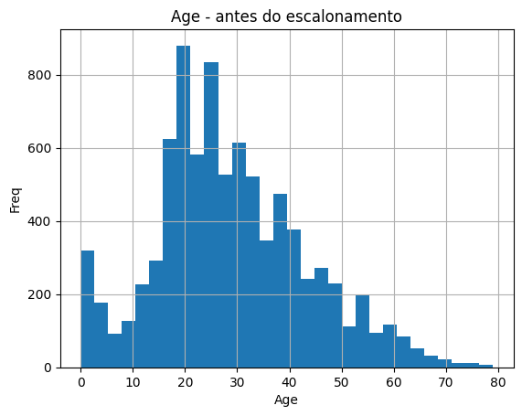
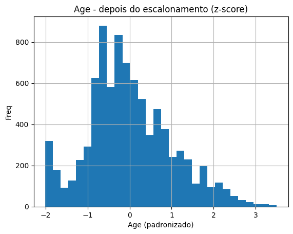
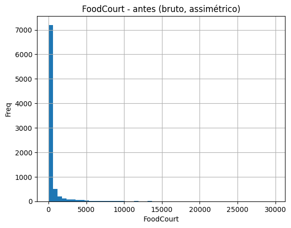
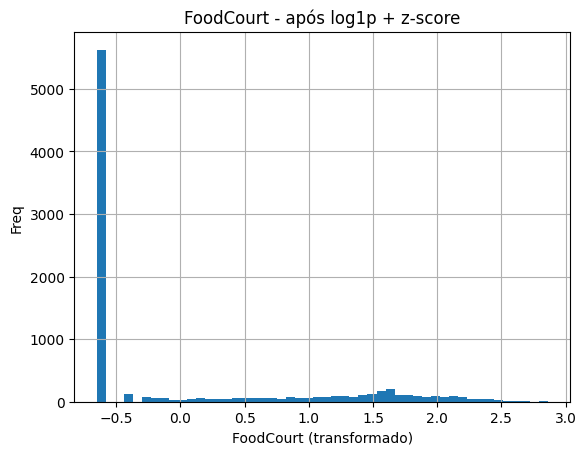

```python
import pandas as pd
import numpy as np
from sklearn.preprocessing import OneHotEncoder
```


```python
df = pd.read_csv("data/spaceship-titanic/train.csv")
df.head(5)
```


<div>
<style scoped>
    .dataframe tbody tr th:only-of-type {
        vertical-align: middle;
    }

    .dataframe tbody tr th {
        vertical-align: top;
    }

    .dataframe thead th {
        text-align: right;
    }
</style>
<table border="1" class="dataframe">
  <thead>
    <tr style="text-align: right;">
      <th></th>
      <th>PassengerId</th>
      <th>HomePlanet</th>
      <th>CryoSleep</th>
      <th>Cabin</th>
      <th>Destination</th>
      <th>Age</th>
      <th>VIP</th>
      <th>RoomService</th>
      <th>FoodCourt</th>
      <th>ShoppingMall</th>
      <th>Spa</th>
      <th>VRDeck</th>
      <th>Name</th>
      <th>Transported</th>
    </tr>
  </thead>
  <tbody>
    <tr>
      <th>0</th>
      <td>0001_01</td>
      <td>Europa</td>
      <td>False</td>
      <td>B/0/P</td>
      <td>TRAPPIST-1e</td>
      <td>39.0</td>
      <td>False</td>
      <td>0.0</td>
      <td>0.0</td>
      <td>0.0</td>
      <td>0.0</td>
      <td>0.0</td>
      <td>Maham Ofracculy</td>
      <td>False</td>
    </tr>
    <tr>
      <th>1</th>
      <td>0002_01</td>
      <td>Earth</td>
      <td>False</td>
      <td>F/0/S</td>
      <td>TRAPPIST-1e</td>
      <td>24.0</td>
      <td>False</td>
      <td>109.0</td>
      <td>9.0</td>
      <td>25.0</td>
      <td>549.0</td>
      <td>44.0</td>
      <td>Juanna Vines</td>
      <td>True</td>
    </tr>
    <tr>
      <th>2</th>
      <td>0003_01</td>
      <td>Europa</td>
      <td>False</td>
      <td>A/0/S</td>
      <td>TRAPPIST-1e</td>
      <td>58.0</td>
      <td>True</td>
      <td>43.0</td>
      <td>3576.0</td>
      <td>0.0</td>
      <td>6715.0</td>
      <td>49.0</td>
      <td>Altark Susent</td>
      <td>False</td>
    </tr>
    <tr>
      <th>3</th>
      <td>0003_02</td>
      <td>Europa</td>
      <td>False</td>
      <td>A/0/S</td>
      <td>TRAPPIST-1e</td>
      <td>33.0</td>
      <td>False</td>
      <td>0.0</td>
      <td>1283.0</td>
      <td>371.0</td>
      <td>3329.0</td>
      <td>193.0</td>
      <td>Solam Susent</td>
      <td>False</td>
    </tr>
    <tr>
      <th>4</th>
      <td>0004_01</td>
      <td>Earth</td>
      <td>False</td>
      <td>F/1/S</td>
      <td>TRAPPIST-1e</td>
      <td>16.0</td>
      <td>False</td>
      <td>303.0</td>
      <td>70.0</td>
      <td>151.0</td>
      <td>565.0</td>
      <td>2.0</td>
      <td>Willy Santantines</td>
      <td>True</td>
    </tr>
  </tbody>
</table>
</div>


```python
print(df.columns)
```

    Index(['PassengerId', 'HomePlanet', 'CryoSleep', 'Cabin', 'Destination', 'Age',
           'VIP', 'RoomService', 'FoodCourt', 'ShoppingMall', 'Spa', 'VRDeck',
           'Name', 'Transported'],
          dtype='object')


```python
# Apaga linhas com mais de 20% dos valores nulos
df = df[df.isnull().mean(axis=1) <= 0.2]
```

### Explorando valores das colunas


```python
num_cols = df.select_dtypes(include=[np.number]).columns
cat_cols = df.select_dtypes(exclude=[np.number]).columns
```


```python
for col in num_cols:
    print(f"Coluna: {col}")
    print(df[col].describe())  # estatísticas básicas
    print(f"Valores nulos: {df[col].isnull().sum()}")

    # Comparação de medidas centrais
    mean_val = df[col].mean()
    median_val = df[col].median()
    mode_val = df[col].mode()[0] if not df[col].mode().empty else None

    print(f"Média  : {mean_val}")
    print(f"Mediana: {median_val}")
    print(f"Moda   : {mode_val}")

    print("=========================================================")
    print("=========================================================")

```

    Coluna: Age
    count    8502.000000
    mean       28.833686
    std        14.488328
    min         0.000000
    25%        19.000000
    50%        27.000000
    75%        38.000000
    max        79.000000
    Name: Age, dtype: float64
    Valores nulos: 174
    Média  : 28.833686191484357
    Mediana: 27.0
    Moda   : 24.0
    =========================================================
    =========================================================
    Coluna: RoomService
    count     8495.000000
    mean       224.907946
    std        667.277226
    min          0.000000
    25%          0.000000
    50%          0.000000
    75%         47.000000
    max      14327.000000
    Name: RoomService, dtype: float64
    Valores nulos: 181
    Média  : 224.90794585050028
    Mediana: 0.0
    Moda   : 0.0
    =========================================================
    =========================================================
    Coluna: FoodCourt
    count     8496.000000
    mean       458.294845
    std       1612.265649
    min          0.000000
    25%          0.000000
    50%          0.000000
    75%         76.250000
    max      29813.000000
    Name: FoodCourt, dtype: float64
    Valores nulos: 180
    Média  : 458.2948446327684
    Mediana: 0.0
    Moda   : 0.0
    =========================================================
    =========================================================
    Coluna: ShoppingMall
    count     8472.000000
    mean       173.909821
    std        605.124872
    min          0.000000
    25%          0.000000
    50%          0.000000
    75%         27.000000
    max      23492.000000
    Name: ShoppingMall, dtype: float64
    Valores nulos: 204
    Média  : 173.909820585458
    Mediana: 0.0
    Moda   : 0.0
    =========================================================
    =========================================================
    Coluna: Spa
    count     8498.000000
    mean       311.479407
    std       1137.450945
    min          0.000000
    25%          0.000000
    50%          0.000000
    75%         59.000000
    max      22408.000000
    Name: Spa, dtype: float64
    Valores nulos: 178
    Média  : 311.4794069192751
    Mediana: 0.0
    Moda   : 0.0
    =========================================================
    =========================================================
    Coluna: VRDeck
    count     8491.000000
    mean       304.638323
    std       1146.250510
    min          0.000000
    25%          0.000000
    50%          0.000000
    75%         45.500000
    max      24133.000000
    Name: VRDeck, dtype: float64
    Valores nulos: 185
    Média  : 304.63832293016134
    Mediana: 0.0
    Moda   : 0.0
    =========================================================
    =========================================================


```python
for col in cat_cols:
    print(f"Coluna: {col}")
    print(f"Número de valores distintos: {df[col].nunique()}")
    print(f"Valores nulos: {df[col].isnull().sum()}")
    print(df[col].value_counts())
    print("=========================================================")
    print("=========================================================")

```

    Coluna: PassengerId
    Número de valores distintos: 8676
    Valores nulos: 0
    PassengerId
    0001_01    1
    6133_01    1
    6139_05    1
    6139_04    1
    6139_03    1
              ..
    3124_01    1
    3123_01    1
    3121_01    1
    3120_02    1
    9280_02    1
    Name: count, Length: 8676, dtype: int64
    =========================================================
    =========================================================
    Coluna: HomePlanet
    Número de valores distintos: 3
    Valores nulos: 196
    HomePlanet
    Earth     4595
    Europa    2129
    Mars      1756
    Name: count, dtype: int64
    =========================================================
    =========================================================
    Coluna: CryoSleep
    Número de valores distintos: 2
    Valores nulos: 211
    CryoSleep
    False    5434
    True     3031
    Name: count, dtype: int64
    =========================================================
    =========================================================
    Coluna: Cabin
    Número de valores distintos: 6552
    Valores nulos: 194
    Cabin
    G/734/S     8
    G/1368/P    7
    F/1194/P    7
    B/201/P     7
    B/11/S      7
               ..
    E/231/S     1
    G/545/S     1
    G/543/S     1
    B/106/P     1
    C/178/S     1
    Name: count, Length: 6552, dtype: int64
    =========================================================
    =========================================================
    Coluna: Destination
    Número de valores distintos: 3
    Valores nulos: 176
    Destination
    TRAPPIST-1e      5906
    55 Cancri e      1800
    PSO J318.5-22     794
    Name: count, dtype: int64
    =========================================================
    =========================================================
    Coluna: VIP
    Número de valores distintos: 2
    Valores nulos: 199
    VIP
    False    8278
    True      199
    Name: count, dtype: int64
    =========================================================
    =========================================================
    Coluna: Name
    Número de valores distintos: 8461
    Valores nulos: 195
    Name
    Juane Popelazquez     2
    Sus Coolez            2
    Ankalik Nateansive    2
    Gwendy Sykess         2
    Keitha Josey          2
                         ..
    Hardy Griffy          1
    Salley Mckinn         1
    Mall Frasp            1
    Heila Gordond         1
    Propsh Hontichre      1
    Name: count, Length: 8461, dtype: int64
    =========================================================
    =========================================================
    Coluna: Transported
    Número de valores distintos: 2
    Valores nulos: 0
    Transported
    True     4368
    False    4308
    Name: count, dtype: int64
    =========================================================
    =========================================================


```python
import numpy as np
import pandas as pd
from sklearn.preprocessing import StandardScaler, MinMaxScaler

# ===============================
# 0) Cópia e remoções básicas
# ===============================
dfp = df.copy()

# alvo (0/1) e remoção de colunas não preditivas
y = dfp['Transported'].map({True: 1, False: 0}).astype('int8')
dfp = dfp.drop(columns=['Transported', 'PassengerId', 'Name'])

# ===============================
# 1) Quebrar Cabin em Deck / Num / Side
# ===============================
def split_cabin(s):
    if pd.isna(s):
        return pd.Series([np.nan, np.nan, np.nan], index=['Deck','CabinNum','Side'])
    parts = str(s).split('/')
    # garante 3 partes
    parts += [np.nan] * (3 - len(parts))
    return pd.Series(parts[:3], index=['Deck','CabinNum','Side'])

dfp[['Deck','CabinNum','Side']] = dfp['Cabin'].apply(split_cabin)
dfp.drop(columns=['Cabin'], inplace=True)
dfp['CabinNum'] = pd.to_numeric(dfp['CabinNum'], errors='coerce')

# ===============================
# 2) Definir grupos de colunas
# ===============================
num_cols_base = ['Age', 'RoomService', 'FoodCourt', 'ShoppingMall', 'Spa', 'VRDeck', 'CabinNum']
bin_cols      = ['CryoSleep', 'VIP']
cat_cols      = ['HomePlanet', 'Destination', 'Deck', 'Side']

# ===============================
# 3) Imputação
# ===============================
# 3.1 Numéricas -> mediana
for c in num_cols_base:
    dfp[c] = dfp[c].fillna(dfp[c].median())

# 3.2 Binárias -> moda e para 0/1
for c in bin_cols:
    if dfp[c].isnull().any():
        dfp[c] = dfp[c].fillna(dfp[c].mode()[0])
    dfp[c] = dfp[c].astype(bool).astype('int8')

# 3.3 Categóricas -> moda
for c in cat_cols:
    if dfp[c].isnull().any():
        dfp[c] = dfp[c].fillna(dfp[c].mode()[0])

# ===============================
# 4) Redução de assimetria nas despesas (opcional, recomendado)
# ===============================
spend_cols = ['RoomService', 'FoodCourt', 'ShoppingMall', 'Spa', 'VRDeck']
for c in spend_cols:
    # log1p: lida bem com zeros (log(0+1)=0)
    dfp[c] = np.log1p(dfp[c])

# ===============================
# 5) One-Hot nas categóricas de baixa cardinalidade
# ===============================
dfp = pd.get_dummies(dfp, columns=cat_cols, drop_first=False, dtype='int8')

# ===============================
# 6) Escalonamento para tanh
#    Escolha 1: StandardScaler (z-score)
# ===============================
scaler = StandardScaler()

# ATENÇÃO: em modelagem real, use scaler.fit(X_train[num_cols]) e depois transforme
num_cols_final = ['Age', 'CabinNum'] + spend_cols
dfp[num_cols_final] = scaler.fit_transform(dfp[num_cols_final])

# (Se preferir MinMax para [-1,1], troque as duas linhas acima por:)
# scaler = MinMaxScaler(feature_range=(-1, 1))
# dfp[num_cols_final] = scaler.fit_transform(dfp[num_cols_final])

# ===============================
# 7) Conjunto final
# ===============================
X = dfp  # todas as features numéricas já prontas
# y já está definido como 0/1
print(X.shape, y.shape)
print("Nulos restantes em X?", X.isnull().sum().sum())

```

    (8676, 25) (8676,)
    Nulos restantes em X? 0


    /var/folders/x9/_d9131zd0kv_7kqrvjfvld9m0000gn/T/ipykernel_34466/3708549578.py:46: FutureWarning: Downcasting object dtype arrays on .fillna, .ffill, .bfill is deprecated and will change in a future version. Call result.infer_objects(copy=False) instead. To opt-in to the future behavior, set `pd.set_option('future.no_silent_downcasting', True)`
      dfp[c] = dfp[c].fillna(dfp[c].mode()[0])
    /var/folders/x9/_d9131zd0kv_7kqrvjfvld9m0000gn/T/ipykernel_34466/3708549578.py:46: FutureWarning: Downcasting object dtype arrays on .fillna, .ffill, .bfill is deprecated and will change in a future version. Call result.infer_objects(copy=False) instead. To opt-in to the future behavior, set `pd.set_option('future.no_silent_downcasting', True)`
      dfp[c] = dfp[c].fillna(dfp[c].mode()[0])


```python
import matplotlib.pyplot as plt

# ---- Age: antes (bruto)
df['Age'].hist(bins=30)
plt.title("Age - antes do escalonamento")
plt.xlabel("Age")
plt.ylabel("Freq")
plt.show()

# ---- Age: depois (z-score)
X['Age'].hist(bins=30)
plt.title("Age - depois do escalonamento (z-score)")
plt.xlabel("Age (padronizado)")
plt.ylabel("Freq")
plt.show()

# ---- FoodCourt: antes (bruto, altamente assimétrico)
df['FoodCourt'].hist(bins=50)
plt.title("FoodCourt - antes (bruto, assimétrico)")
plt.xlabel("FoodCourt")
plt.ylabel("Freq")
plt.show()

# ---- FoodCourt: após log1p + z-score
X['FoodCourt'].hist(bins=50)
plt.title("FoodCourt - após log1p + z-score")
plt.xlabel("FoodCourt (transformado)")
plt.ylabel("Freq")
plt.show()

```


    

    


    

    


    

    


    

    


```python
X.head(10)
```


<div>
<style scoped>
    .dataframe tbody tr th:only-of-type {
        vertical-align: middle;
    }

    .dataframe tbody tr th {
        vertical-align: top;
    }

    .dataframe thead th {
        text-align: right;
    }
</style>
<table border="1" class="dataframe">
  <thead>
    <tr style="text-align: right;">
      <th></th>
      <th>CryoSleep</th>
      <th>Age</th>
      <th>VIP</th>
      <th>RoomService</th>
      <th>FoodCourt</th>
      <th>ShoppingMall</th>
      <th>Spa</th>
      <th>VRDeck</th>
      <th>CabinNum</th>
      <th>HomePlanet_Earth</th>
      <th>...</th>
      <th>Deck_A</th>
      <th>Deck_B</th>
      <th>Deck_C</th>
      <th>Deck_D</th>
      <th>Deck_E</th>
      <th>Deck_F</th>
      <th>Deck_G</th>
      <th>Deck_T</th>
      <th>Side_P</th>
      <th>Side_S</th>
    </tr>
  </thead>
  <tbody>
    <tr>
      <th>0</th>
      <td>0</td>
      <td>0.711326</td>
      <td>0</td>
      <td>-0.638230</td>
      <td>-0.650345</td>
      <td>-0.623215</td>
      <td>-0.664376</td>
      <td>-0.639889</td>
      <td>-1.176597</td>
      <td>0</td>
      <td>...</td>
      <td>0</td>
      <td>1</td>
      <td>0</td>
      <td>0</td>
      <td>0</td>
      <td>0</td>
      <td>0</td>
      <td>0</td>
      <td>1</td>
      <td>0</td>
    </tr>
    <tr>
      <th>1</th>
      <td>0</td>
      <td>-0.334425</td>
      <td>0</td>
      <td>1.090151</td>
      <td>0.134604</td>
      <td>0.645463</td>
      <td>1.613318</td>
      <td>0.746441</td>
      <td>-1.176597</td>
      <td>1</td>
      <td>...</td>
      <td>0</td>
      <td>0</td>
      <td>0</td>
      <td>0</td>
      <td>0</td>
      <td>1</td>
      <td>0</td>
      <td>0</td>
      <td>0</td>
      <td>1</td>
    </tr>
    <tr>
      <th>2</th>
      <td>0</td>
      <td>2.035943</td>
      <td>1</td>
      <td>0.753228</td>
      <td>2.138986</td>
      <td>-0.623215</td>
      <td>2.516585</td>
      <td>0.784811</td>
      <td>-1.176597</td>
      <td>0</td>
      <td>...</td>
      <td>1</td>
      <td>0</td>
      <td>0</td>
      <td>0</td>
      <td>0</td>
      <td>0</td>
      <td>0</td>
      <td>0</td>
      <td>0</td>
      <td>1</td>
    </tr>
    <tr>
      <th>3</th>
      <td>0</td>
      <td>0.293025</td>
      <td>0</td>
      <td>-0.638230</td>
      <td>1.789720</td>
      <td>1.681556</td>
      <td>2.263357</td>
      <td>1.278586</td>
      <td>-1.176597</td>
      <td>0</td>
      <td>...</td>
      <td>1</td>
      <td>0</td>
      <td>0</td>
      <td>0</td>
      <td>0</td>
      <td>0</td>
      <td>0</td>
      <td>0</td>
      <td>0</td>
      <td>1</td>
    </tr>
    <tr>
      <th>4</th>
      <td>0</td>
      <td>-0.892158</td>
      <td>0</td>
      <td>1.463938</td>
      <td>0.802798</td>
      <td>1.333045</td>
      <td>1.623669</td>
      <td>-0.239791</td>
      <td>-1.174624</td>
      <td>1</td>
      <td>...</td>
      <td>0</td>
      <td>0</td>
      <td>0</td>
      <td>0</td>
      <td>0</td>
      <td>1</td>
      <td>0</td>
      <td>0</td>
      <td>0</td>
      <td>1</td>
    </tr>
    <tr>
      <th>5</th>
      <td>0</td>
      <td>1.059909</td>
      <td>0</td>
      <td>-0.638230</td>
      <td>1.457122</td>
      <td>-0.623215</td>
      <td>1.384764</td>
      <td>-0.639889</td>
      <td>-1.176597</td>
      <td>1</td>
      <td>...</td>
      <td>0</td>
      <td>0</td>
      <td>0</td>
      <td>0</td>
      <td>0</td>
      <td>1</td>
      <td>0</td>
      <td>0</td>
      <td>1</td>
      <td>0</td>
    </tr>
    <tr>
      <th>6</th>
      <td>0</td>
      <td>-0.194991</td>
      <td>0</td>
      <td>0.744775</td>
      <td>1.851696</td>
      <td>-0.083403</td>
      <td>-0.664376</td>
      <td>-0.639889</td>
      <td>-1.172651</td>
      <td>1</td>
      <td>...</td>
      <td>0</td>
      <td>0</td>
      <td>0</td>
      <td>0</td>
      <td>0</td>
      <td>1</td>
      <td>0</td>
      <td>0</td>
      <td>0</td>
      <td>1</td>
    </tr>
    <tr>
      <th>7</th>
      <td>1</td>
      <td>-0.055558</td>
      <td>0</td>
      <td>-0.638230</td>
      <td>-0.650345</td>
      <td>-0.623215</td>
      <td>-0.664376</td>
      <td>-0.639889</td>
      <td>-1.176597</td>
      <td>1</td>
      <td>...</td>
      <td>0</td>
      <td>0</td>
      <td>0</td>
      <td>0</td>
      <td>0</td>
      <td>0</td>
      <td>1</td>
      <td>0</td>
      <td>0</td>
      <td>1</td>
    </tr>
    <tr>
      <th>8</th>
      <td>0</td>
      <td>0.432459</td>
      <td>0</td>
      <td>-0.638230</td>
      <td>1.622414</td>
      <td>0.502273</td>
      <td>1.277608</td>
      <td>-0.639889</td>
      <td>-1.170678</td>
      <td>1</td>
      <td>...</td>
      <td>0</td>
      <td>0</td>
      <td>0</td>
      <td>0</td>
      <td>0</td>
      <td>1</td>
      <td>0</td>
      <td>0</td>
      <td>0</td>
      <td>1</td>
    </tr>
    <tr>
      <th>9</th>
      <td>1</td>
      <td>-1.031592</td>
      <td>0</td>
      <td>-0.638230</td>
      <td>-0.650345</td>
      <td>-0.623215</td>
      <td>-0.664376</td>
      <td>-0.639889</td>
      <td>-1.174624</td>
      <td>0</td>
      <td>...</td>
      <td>0</td>
      <td>1</td>
      <td>0</td>
      <td>0</td>
      <td>0</td>
      <td>0</td>
      <td>0</td>
      <td>0</td>
      <td>1</td>
      <td>0</td>
    </tr>
  </tbody>
</table>
<p>10 rows × 25 columns</p>
</div>


